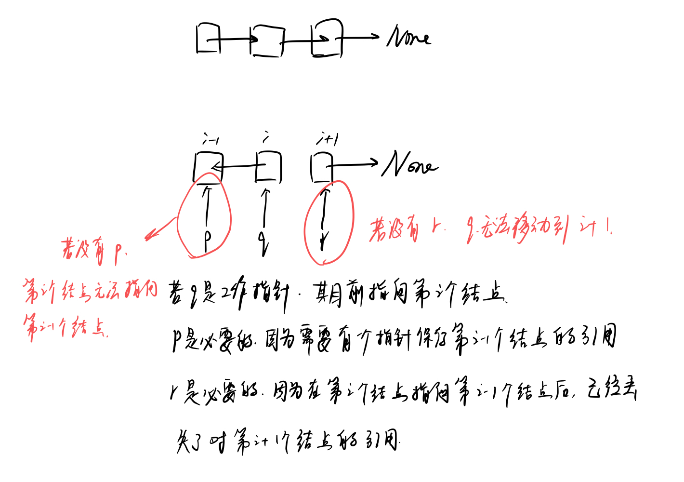
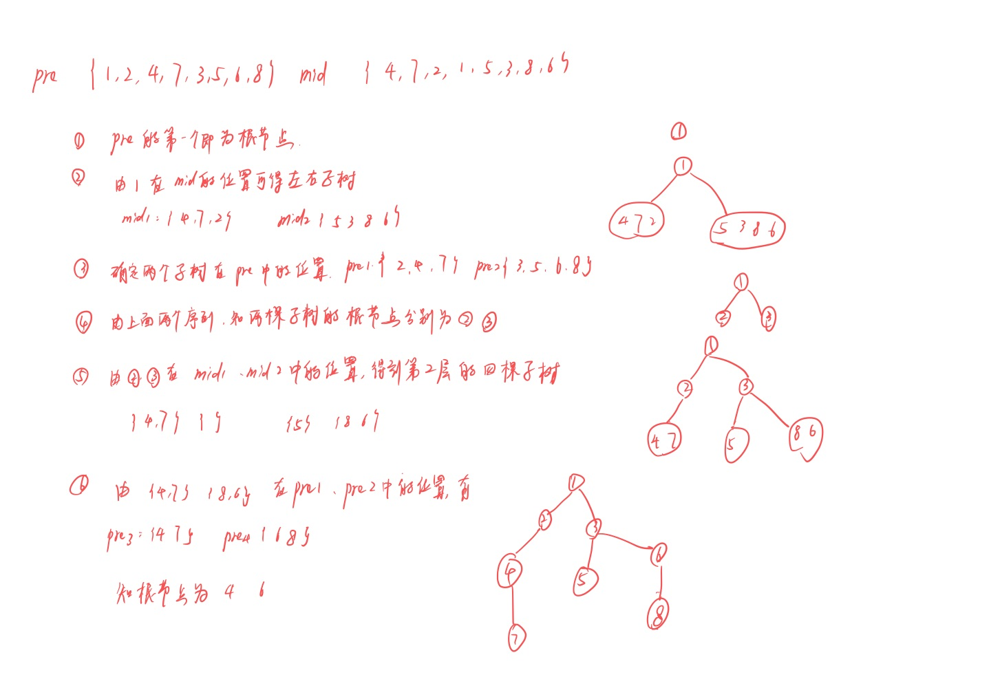

[toc]

# Leetcode

https://blog.csdn.net/tinkle181129/article/details/79326023

## 19.09.26

### 1. 删除链表中重复的结点

https://www.nowcoder.com/practice/fc533c45b73a41b0b44ccba763f866ef?tpId=13&tqId=11209&tPage=3&rp=3&ru=/ta/coding-interviews&qru=/ta/coding-interviews/question-ranking

>
>题目描述
>在一个排序的链表中，存在重复的结点，请删除该链表中重复的结点，重复的结点不保留，返回链表头指针。 例如，链表1->2->3->3->4->4->5 处理后为 1->2->5

#### Method1

```
class Solution:
 
    def deleteDuplication(self, pHead):
 
        if pHead is None or pHead.next is None: # 只有一个节点或两个节点的情况
            return pHead
         
        vHead = ListNode(0)
        vHead.next = pHead      # 添加虚拟节点指向头节点
         
        p = vHead
        q = vHead.next
         
        while q is not None:    # 注意要判空
            if q.next is not None and q.val==q.next.val:            # 在先对 q.next 判断之后再对 q.next 取 val
                while q.next is not None and q.val == q.next.val:   # 虽然之前已经判断过 q.next，但是在while循环中修改了 q 的值，因此这里对 q.next 的判空也是必要的
                    q = q.next
                p.next = q.next
                q = q.next
            else:
                p = p.next
                q = q.next
        return vHead.next
```

1. 添加一个虚拟节点vHead。因为删除链表中的元素是修改指针，如果要删除第二个元素，那么就需要修改第一个元素的指针。
2. 有两个指针，一个p，一个q。p指向扫过的元素中最后一个确定不重复的元素。而q是工作指针。
3. 判断元素是否重复时可以只用 q 来判断。不需要同时使用 p，q。


### 2. 斐波那契数列

不可取的做法：直接使用 f(n+1) = f(n) + f(n-1) 递归。这样当n比较大的时候效率很低。
因为大量的重复计算。

#### Method1

不采用递归的思想从大到小计算，而是采用普通的迭代的思想，从小到大计算。

直观的想法

```
class Solution:
    def Fibonacci(self, n):
        f0 = 0
        f1 = 1
        result = 0
        if n == 0:
            return f0
        if n == 1:
            return f1
        for i in range(n-1):
            result = f0 + f1
            f0 = f1
            f1 = result
        return result
```

上面的方法中使用了三个变量。实际上有两个变量就可以解决，下面是 pythonic的写法：


```
class Solution:
    def Fibonacci(self, n):
        f0 = 0
        f1 = 1
        for i in range(n):
            f0, f1 = f1, f0 + f1
        return f0
```

这种写法比上面的写法的好处是 1. 不需要进行边界条件的判断 2. 充分利用了python的语言特性。

#### Method2 未完。之后看动态规划。


## 09.27

### 3. 链表反转

- [反转链表__牛客网](https://www.nowcoder.com/questionTerminal/75e878df47f24fdc9dc3e400ec6058ca)

>输入一个链表，反转链表后，输出新链表的表头。

#### Method1

```
# -*- coding:utf-8 -*-
# class ListNode:
#     def __init__(self, x):
#         self.val = x
#         self.next = None

class Solution:
    # 返回ListNode
    def ReverseList(self, pHead):
        p = None
        q = pHead
        if q is None:
            return None
        else:
            r = q.next
            while q is not None:
                q.next = p
                p = q
                q = r
                r = r.next if r is not None else None
            return p
```

注意有三个指针。



#### Method2 递归

```
class Solution:
    # 返回ListNode
    def ReverseList(self, pHead):
        if pHead is None or pHead.next is None:
            return pHead
        else: 
            new_head = self.ReverseList(pHead.next) # 返回新的头节点

            # 修改链的尾部
            pHead.next.next = pHead
            pHead.next = None
            return new_head
```


### 4. 合并两个排序的链表

>题目描述
>输入两个单调递增的链表，输出两个链表合成后的链表，当然我们需要合成后的链表满足单调不减规则。

#### Method1 

```
# -*- coding:utf-8 -*-
# class ListNode:
#     def __init__(self, x):
#         self.val = x
#         self.next = None

class Solution:
    # 返回合并后列表
    def Merge(self, pHead1, pHead2):
        # write code here
        if pHead1 is None: return pHead2
        if pHead2 is None: return pHead1
        p, q = pHead1, pHead2
        new_node = ListNode(0)
        r = new_node
        while p is not None and q is not None:
            if p.val <= q.val:
                r.next = p
                p = p.next
            else:
                r.next = q
                q = q.next
            r = r.next
        if p is None:
            r.next = q
        if q is None:
            r.next = p
        return new_node.next
```

#### Method2 递归

```
# -*- coding:utf-8 -*-
# class ListNode:
#     def __init__(self, x):
#         self.val = x
#         self.next = None

class Solution:

    # 返回合并后列表
    def Merge(self, pHead1, pHead2):
        # write code here
        if pHead1 is None: return pHead2
        if pHead2 is None: return pHead1
        if pHead1.val <= pHead2.val:
            mergeHead = self.Merge(pHead1.next, pHead2)
            pHead1.next = mergeHead
            return pHead1
        else:
            mergeHead = self.Merge(pHead2.next, pHead1)
            pHead2.next = mergeHead
            return pHead2
```

### 5. 链表中倒数第k个结点

>题目描述
>输入一个链表，输出该链表中倒数第k个结点


```
# -*- coding:utf-8 -*-
# class ListNode:
#     def __init__(self, x):
#         self.val = x
#         self.next = None

class Solution:
    def FindKthToTail(self, head, k):
        # write code here
        p = head
        q = head
        n = k
        while n > 0:
            if p is not None:
                p = p.next
                n -= 1
            else:
                return None
        while p is not None:
            p = p.next
            q = q.next
        return q
```

思路：两个指针p和q。指针p先走k步。之后一起走。当p指向None时，q指向倒数第k个节点。


## 19.09.30

### 6. 二叉树的镜像

- [二叉树的镜像_牛客网](https://www.nowcoder.com/practice/564f4c26aa584921bc75623e48ca3011?tpId=13&tqId=11171&tPage=1&rp=1&ru=/ta/coding-interviews&qru=/ta/coding-interviews/question-ranking)

```
题目描述
操作给定的二叉树，将其变换为源二叉树的镜像。
输入描述:
二叉树的镜像定义：源二叉树 
    	    8
    	   /  \
    	  6   10
    	 / \  / \
    	5  7 9 11

    	镜像二叉树
    	    8
    	   /  \
    	  10   6
    	 / \  / \
    	11 9 7  5
```

#### Method1 递归

```
# -*- coding:utf-8 -*-
# class TreeNode:
#     def __init__(self, x):
#         self.val = x
#         self.left = None
#         self.right = None

class Solution:
    # 返回镜像树的根节点
    def Mirror(self, root):
        # write code here
        if root is None:
            return root
        else:
            root.left, root.right = root.right, root.left
            self.Mirror(root.left)
            self.Mirror(root.right)
            return root
```

### 7. 二叉树的深度

- [二叉树的深度_牛客网](https://www.nowcoder.com/practice/435fb86331474282a3499955f0a41e8b?tpId=13&tqId=11191&tPage=1&rp=1&ru=/ta/coding-interviews&qru=/ta/coding-interviews/question-ranking)

>题目描述
>输入一棵二叉树，求该树的深度。从根结点到叶结点依次经过的结点（含根、叶结点）形成树的一条路径，最长路径的长度为树的深度。


#### Method1 递归

```
# -*- coding:utf-8 -*-
# class TreeNode:
#     def __init__(self, x):
#         self.val = x
#         self.left = None
#         self.right = None
class Solution:
    def TreeDepth(self, pRoot):
        # write code here
        if pRoot is None:
            return 0
        else:
            return max( 1 + self.TreeDepth(pRoot.left),
                       1 + self.TreeDepth(pRoot.right)
                      )
```

#### Method2 使用栈

```
# -*- coding:utf-8 -*-
# class TreeNode:
#     def __init__(self, x):
#         self.val = x
#         self.left = None
#         self.right = None

class Solution:
    def TreeDepth(self, pRoot):
        # write code here
        max_height = 0
        st = []
        st.append((pRoot, 0))
        while len(st) > 0:
            start, height = st.pop()
            if start is None:
                if max_height < height:
                    max_height = height
            else:
                st.append((start.right, height+1))
                st.append((start.left, height+1))
        return max_height
```

### 8. 平衡二叉树的判断

>题目描述
>输入一棵二叉树，判断该二叉树是否是平衡二叉树。

BST的定义为 `|height(lefttree)−height(righttree)|<=1`，原问题拆分为计算树高度和判断高度差。

#### Method1 用栈求高度

```
# -*- coding:utf-8 -*-
# class TreeNode:
#     def __init__(self, x):
#         self.val = x
#         self.left = None
#         self.right = None

class Solution:
    def IsBalanced_Solution(self, pRoot):
        # write code here
        if pRoot is None:
            return True
        else:
            def compute_height(root):
                st = [] # 这个list相当于一个list
                st.append((root, 0))
                max_height = 0
                while len(st) > 0:
                    start, height = st.pop()
                    if start is not None:
                        st.append((start.right, height+1))
                        st.append((start.left, height+1))
                    else:
                        if max_height < height:
                            max_height = height
                return max_height
            return abs(compute_height(pRoot.left) - compute_height(pRoot.right)) <= 1
```


#### Method2

```
class Solution:
    def IsBalanced_Solution(self, pRoot):
        # write code here
        if pRoot is None:
            return True
        else:
            def compute_height(root):
                if root is None:
                    return 0
                else:
                    return max(1 + compute_height(root.left) , 1 + compute_height(root.right))
            return abs(compute_height(pRoot.left) - compute_height(pRoot.right)) <= 1
```


这两个方法的想法是一样的，只不过求树的高度的实现不太一样。


### 9. 重建二叉树

- [重建二叉树_牛客网](https://www.nowcoder.com/practice/8a19cbe657394eeaac2f6ea9b0f6fcf6?tpId=13&tqId=11157&tPage=1&rp=1&ru=%2Fta%2Fcoding-interviews&qru=%2Fta%2Fcoding-interviews%2Fquestion-ranking)

>题目描述
>输入某二叉树的前序遍历和中序遍历的结果，请重建出该二叉树。假设输入的前序遍历和中序遍历的结果中都不含重复的数字。例如输入前序遍历序列{1,2,4,7,3,5,6,8}和中序遍历序列{4,7,2,1,5,3,8,6}，则重建二叉树并返回。


#### Method1 递归

思路：利用先根序来确定根结点的位置，然后利用中根序来确定左右子树中的元素。




```
# -*- coding:utf-8 -*-
# class TreeNode:
#     def __init__(self, x):
#         self.val = x
#         self.left = None
#         self.right = None

class Solution:
    # 返回构造的TreeNode根节点
    def reConstructBinaryTree(self, pre, tin):
        # write code here
        if pre == []:
            return None 
        root = TreeNode(pre[0])
        i = tin.index(pre[0])
        
        # 得到了左右子树
        left_tin, right_tin = tin[:i], tin[i+1:]
        # 利用中根序列中寻找到的左右子树，在先根序列中寻找对应的序列
        left_pre, right_pre = [x for x in pre if x in left_tin], [x for x in pre if x in right_tin]
        root.left = self.reConstructBinaryTree(left_pre, left_tin)
        root.right = self.reConstructBinaryTree(right_pre, right_tin)
        
        return root
```

#### Method1 改（有点不好理解。为什么递归的时使用的是pre）

```
class Solution:
    def reConstructBinaryTree(self, pre, tin):
        if not pre or not tin:
            return None
        root = TreeNode(pre.pop(0))
        index = tin.index(root.val)
        root.left = self.reConstructBinaryTree(pre, tin[:index])
        root.right = self.reConstructBinaryTree(pre, tin[index + 1:])
        return root
```

## 19.10.03

### 10. 二叉树的下一个结点

- [二叉树的下一个结点_牛客网](https://www.nowcoder.com/practice/9023a0c988684a53960365b889ceaf5e?tpId=13&tqId=11210&tPage=1&rp=1&ru=/ta/coding-interviews&qru=/ta/coding-interviews/question-ranking)

>题目描述
>给定一个二叉树和其中的一个结点，请找出中序遍历顺序的下一个结点并且返回。注意，树中的结点不仅包含左右子结点，同时包含指向父结点的指针。

思路：如果该结点有右子树，则下一个结点是右子树的最左边的结点；如果该结点无右子树，则考虑其父结点：若该结点是父结点的左结点，则下一个结点是父结点；若该结点是父结点的右结点，则下一结点继续向上回溯。

#### Method1

```
class Solution:

    def GetNext(self, pNode):
        # write code here
        if pNode.right:#有右子树
            p=pNode.right
            while p.left:
                p=p.left
            return p
        while pNode.next:#无右子树，则找第一个当前节点是父节点左孩子的节点
            if(pNode.next.left==pNode):
                return pNode.next
            pNode = pNode.next#沿着父节点向上遍历
        return  #到了根节点仍没找到，则返回空
```


## 19.11.23

### 打印杨辉三角

[(2条未读通知) 杨辉三角__牛客网](https://www.nowcoder.com/questionTerminal/e98bd047f1cf498298b1f19a5170f06d)
